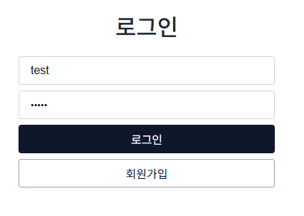
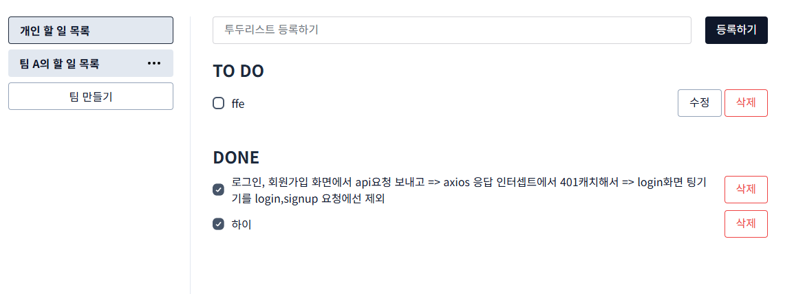

## 프로젝트명 (Project Name)

팀 기반 To-Do List 웹 애플리케이션

---

## 기술 스택 (Tech Stack)

- Frontend: React, TypeScript
- Backend: Express, TypeScript
- Database: MariaDB
- Build Tool: Vite
- HTTP Client: Axios
- Version Control: Git

---

## 주요 기능 (Features)

- 사용자 로그인 및 회원가입
- 개인 및 팀 기반 투두리스트 작성
- 할 일 추가, 수정, 삭제
- 팀 생성 및 초대
- 팀원 관리 (초대/삭제)

---

## 문서 링크 (Documentation)

- [API 명세서](./docs/api/api.md)
- [DB 스키마](./docs/schema.md)
- [백엔드 개요](./docs/Backend.md)
- [프론트엔드 개요](./docs/Frontend.md)

---

## 스크린샷 (Screenshots)

---

## 팀원 소개 (Contributors)

| 이름   | 역할            | GitHub                                                         |
| ------ | --------------- | -------------------------------------------------------------- |
| 김보민 | 프론트엔드 개발 | [https://github.com/bominkim90](https://github.com/bominkim90) |
| 이정찬 | 백엔드 개발     | [https://github.com/chan3199](https://github.com/chan3199)     |

---

## 프로젝트 정보

- 프로젝트 기간: 2025년 5월 12일 ~ 2025년 5월 25일
- 협업 도구: GitHub, Notion
- 진행 방식: 팀별 Git 브랜치 관리, PR 기반 협업, 스크럼 활용

---
