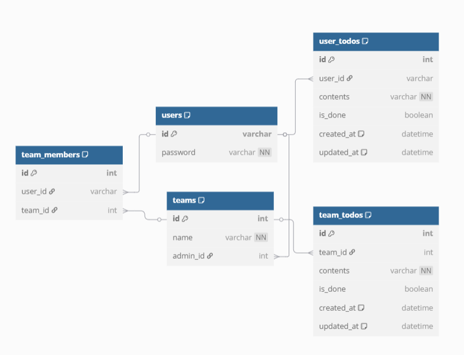

# 백엔드

Node.js + Express + Prisma 기반의 백엔드 서버입니다.  
JWT 쿠키 인증을 적용했고, 개인/팀 Todo 기능을 제공합니다다

---

## 기술 스택

- Node.js
- Express
- TypeScript
- Prisma (ORM)
- MariaDB
- JWT (httpOnly 쿠키 기반 인증)
- Swagger (OpenAPI 문서 자동화)

---

## 폴더 구조

backend  
├── prisma
│ ├── schema.prisma  
│ └── migrations/  
├── src  
│ ├── controller # 요청 처리 로직 (라우터 연결)  
│ ├── routes # API 엔드포인트 정의  
│ ├── services # 비즈니스 로직 처리  
│ ├── middlewares # 인증 미들웨어  
│ ├── prisma # Prisma Client 인스턴스  
│ ├── types # 타입 확장 (req.user 등)  
│ ├── app.ts # Express 앱 설정  
│ └── swagger.ts # Swagger 문서 설정  
├── .env # 실제 환경 변수  
├── .example.env # 예시 환경 변수  
├── package.json  
└── tsconfig.json

---

## 실행 방법

### 1. 의존성 설치

```bash
cd backend
npm install
```

### 2. Prisma Client 생성 및 DB 스키마 반영

```bash
npx prisma generate       # Prisma Client 생성
npx prisma migrate dev    # 기존 DB 있을 경우에에
npx prisma db push        # 기존 DB에 강제 반영
```

### 개발 서버 실행

```bash
npm run dev
```

### 환경 변수 설정

로컬 환경에 맞게 .env 파일 생성

```bash
PORT=3000
DB_HOST=localhost
DB_USER=root
DB_PASSWORD=root
DB_NAME=todo_app
DATABASE_URL="database_url"
JWT_SECRET=secret
```

### 주요 기능

- 회원가입 / 로그인 (ID & 비밀번호 기반)

- JWT + httpOnly 쿠키 기반 인증

- 개인 Todo CRUD

- 팀 생성 / 초대 / 삭제 / 팀원 강퇴

- 팀 Todo 생성 / 수정 / 완료 체크 / 삭제

- 팀 목록 및 팀 상세 조회

- 인증 미들웨어를 통한 보호 API 처리

### API 문서

- Swagger UI : http://localhost:3000/api-docs
- [API 명세서](./docs/api.md)

### ERD


