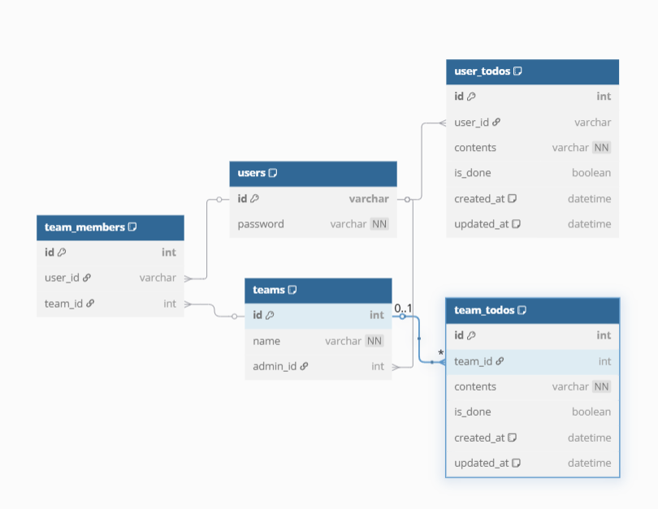

# 📦 DB 테이블 설계 - 투두리스트 프로젝트


```
Table users {
  id        varchar [pk]
  password  varchar [not null]

  Note: '유저 계정 정보'
}

Table teams {
  id        int     [pk, increment]
  name      varchar [not null]
  admin_id  int     [ref: > users.id]

  Note: '팀 정보 및 관리자'
}

Table team_members {
  id        int  [pk, increment]
  user_id   varchar  [ref: > users.id]
  team_id   int  [ref: > teams.id]

  Note: '유저와 팀의 소속 관계 (N:N)'
}

Table user_todos {
  id         int     [pk, increment]
  user_id    varchar     [ref: > users.id] // 작성자
  contents   varchar [not null]
  is_done    boolean
  created_at datetime [default: `now()`]
  updated_at datetime [default: `now()`]

  Note: '유저 할 일 데이터'
}

Table team_todos {
  id         int     [pk, increment]
  team_id    int     [ref: > teams.id]
  contents   varchar [not null]
  is_done    boolean
  created_at datetime [default: `now()`]
  updated_at datetime [default: `now()`]

  Note: '팀 할 일 데이터'
}
```

## 🧑‍💻 users (유저 계정 정보)

| 컬럼명      | 타입      | 제약 조건    | 설명           |
| -------- | ------- | -------- | ------------ |
| id       | varchar | PK       | 사용자 ID (고유값) |
| password | varchar | NOT NULL | 비밀번호         |

---

## 👥 teams (팀 정보 및 관리자)

| 컬럼명       | 타입      | 제약 조건               | 설명            |
| --------- | ------- | ------------------- | ------------- |
| id        | int     | PK, AUTO\_INCREMENT | 팀 ID          |
| name      | varchar | NOT NULL            | 팀 이름          |
| admin\_id | int     | FK → users.id       | 팀 관리자 (유저 ID) |

---

## 🤝 team\_members (유저와 팀의 소속 관계 - N\:N)

| 컬럼명      | 타입      | 제약 조건               | 설명       |
| -------- | ------- | ------------------- | -------- |
| id       | int     | PK, AUTO\_INCREMENT | 식별자      |
| user\_id | varchar | FK → users.id       | 유저 ID    |
| team\_id | int     | FK → teams.id       | 소속된 팀 ID |

---

## 📝 user\_todos (유저 할 일 데이터)

| 컬럼명         | 타입       | 제약 조건               | 설명     |
| ----------- | -------- | ------------------- | ------ |
| id          | int      | PK, AUTO\_INCREMENT | 식별자    |
| user\_id    | varchar  | FK → users.id       | 작성자 ID |
| contents    | varchar  | NOT NULL            | 할 일 내용 |
| is\_done    | boolean  |                     | 완료 여부  |
| created\_at | datetime | DEFAULT: now()      | 생성일    |
| updated\_at | datetime | DEFAULT: now()      | 수정일    |

---

## 📋 team\_todos (팀 할 일 데이터)

| 컬럼명         | 타입       | 제약 조건               | 설명     |
| ----------- | -------- | ------------------- | ------ |
| id          | int      | PK, AUTO\_INCREMENT | 식별자    |
| team\_id    | int      | FK → teams.id       | 팀 ID   |
| contents    | varchar  | NOT NULL            | 할 일 내용 |
| is\_done    | boolean  |                     | 완료 여부  |
| created\_at | datetime | DEFAULT: now()      | 생성일    |
| updated\_at | datetime | DEFAULT: now()      | 수정일    |

---
